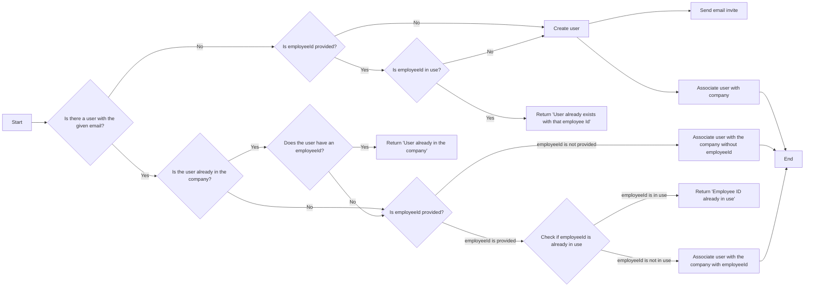

# Add a user to a company

```mermaid
graph LR
    Start[Start] --> CheckEmail{Is there a user with the given email?}
    CheckEmail --> |No| CheckEmployeeId{Is employeeId provided?}
    CheckEmployeeId --> |No| CreateUser[Create user]
    CreateUser --> SendMail[Send email invite]
    CreateUser --> AssociateUserCompany[Associate user with company]
    AssociateUserCompany --> End
    CheckEmployeeId --> |Yes| CheckEmployeeInUse{Is employeeId in use?}
    CheckEmployeeInUse --> |Yes| UserExists[Return 'User already exists with that employee Id']
    CheckEmployeeInUse --> |No| CreateUser
    CheckEmail --> |Yes| CheckCompanyMembership{Is the user already in the company?}
    CheckCompanyMembership --> |No| CheckEmployeeIdForAssociation{Is employeeId provided?}
    CheckEmployeeIdForAssociation --> |employeeId is not provided| AssociateWithoutEmployeeId[Associate user with the company without employeeId]
    CheckEmployeeIdForAssociation --> |employeeId is provided| VerifyEmployeeIdUsage{Check if employeeId is already in use}
    VerifyEmployeeIdUsage --> |employeeId is in use| ReturnEmployeeIdInUse[Return 'Employee ID already in use']
    VerifyEmployeeIdUsage --> |employeeId is not in use| AssociateWithEmployeeId[Associate user with the company with employeeId]
    AssociateWithoutEmployeeId --> End[End]
    AssociateWithEmployeeId --> End[End]
    CheckCompanyMembership --> |Yes| CheckUserEmployeeId{Does the user have an employeeId?}
    CheckUserEmployeeId --> |No| CheckEmployeeIdForAssociation
    CheckUserEmployeeId --> |Yes| ReturnUserInCompany[Return 'User already in the company']
```