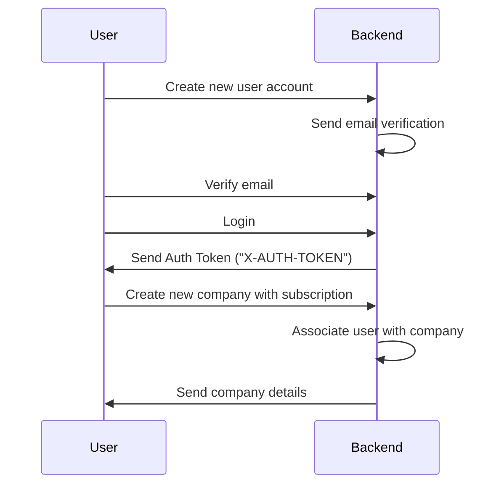

# User signup with a Company

```mermaid
sequenceDiagram
User->>Backend: Create new user account
Backend->>Backend: Send email verification
User->>Backend: Verify email
User->>Backend: Login
Backend->>User: Send Auth Token ("X-AUTH-TOKEN")
User->>Backend: Create new company with subscription
Backend->>Backend: Associate user with company
Backend->>User: Send company details
```