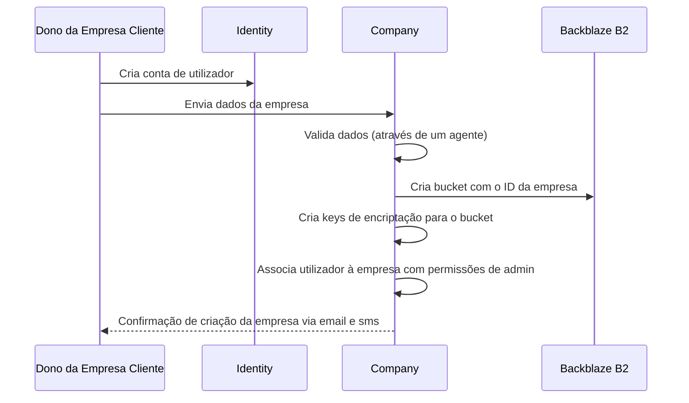

# Criação de uma nova empresa

Uma empresa pode ser criada de duas formas:
* Portal Online
* Portal Interno de Vendas (CRM)

## Flow

```mermaid
sequenceDiagram
    Dono da Empresa Cliente->>Identity: Cria conta de utilizador
    Dono da Empresa Cliente->>Company: Envia dados da empresa
    Company->>Company: Valida dados (através de um agente)
    Company->>Backblaze B2: Cria bucket com o ID da empresa
    Company->>Company: Cria keys de encriptação para o bucket
    Company->>Company: Associa utilizador à empresa com permissões de admin
    Company-->>Dono da Empresa Cliente: Confirmação de criação da empresa via email e sms
```